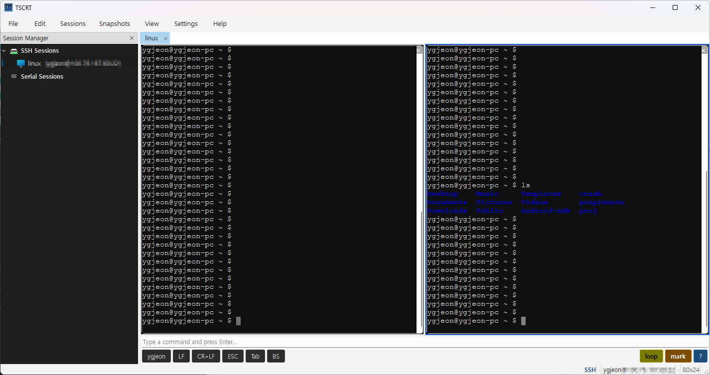

# TSCRT

**Windows, Linux, macOS 에서 모두 동작합니다.**

**TSCRT** 는 Qt 6, libssh2, libvterm 으로 구현한 크로스플랫폼 SSH / 시리얼 콘솔 터미널 에뮬레이터입니다. 임베디드 장비, 네트워크 장비, 원격 서버를 다루는 엔지니어를 위해 안정적이고 스크립트로 자동화할 수 있는 다중 세션 콘솔을 목표로 합니다.

[English](README.md) | **한국어** | [日本語](README.ja.md) | [中文](README.zh.md) | [Español](README.es.md) | [Français](README.fr.md) | [Deutsch](README.de.md) | [Português](README.pt.md) | [Русский](README.ru.md) | [Italiano](README.it.md)



---

## 다운로드

미리 빌드된 배포 파일은 [GitHub Releases](https://github.com/nice1972/TSCRT/releases/latest) 에서 받을 수 있습니다.

| 플랫폼 | 파일 | 비고 |
|--------|------|------|
| **Windows x64** | [tscrt_win-1.0.6-win64.exe](https://github.com/nice1972/TSCRT/releases/download/v1.0.6/tscrt_win-1.0.6-win64.exe) | NSIS 설치 관리자 |
| **Ubuntu / Debian (amd64)** | [tscrt_1.0.6_amd64.deb](https://github.com/nice1972/TSCRT/releases/download/v1.0.6/tscrt_1.0.6_amd64.deb) | `sudo apt install ./tscrt_1.0.6_amd64.deb` |
| **macOS (Universal: Apple Silicon + Intel)** | [tscrt_mac-1.0.6-universal.dmg](https://github.com/nice1972/TSCRT/releases/download/v1.0.6/tscrt_mac-1.0.6-universal.dmg) | `tscrt_mac.app` 을 `/Applications` 으로 끌어 놓기. 첫 실행: 우클릭 → 열기 (서명 없음). |

---

## 주요 기능

### 세션 / 터미널
- libssh2 기반 **SSH** 세션 — keepalive, 자동 재접속, **호스트 키 검증 (TOFU)**
- 임베디드 타깃을 위한 **시리얼 / RS-232** 세션
- 영속 프로파일 기반 다중 탭 세션 관리
- **세션별 터미널 타입** (xterm-256color, vt100 등), 글로벌 기본값 폴백
- 탭 단위 **분할창** (수평/수직) + **입력 브로드캐스트** (`Ctrl+Shift+B`)
- 전체 스크롤백 대상 정규식 **검색바** (`Ctrl+F`) + **Mark** 하이라이트
- 전체화면 (`F11`) — 모든 단축키 유지

### 멀티 윈도우 / 탭 링크
- **탭 분리** — 우클릭 → "Detach to New Window" 로 새 TSCRT 창으로 이동 (연결 유지)
- **윈도우 간 탭 드래그** — 드래그해서 다른 TSCRT 창에 드롭
- **탭 링크 (Tab Link)** — 같은 머신의 두 TSCRT 인스턴스 사이에서 탭 활성화를 동기화. 탭 우클릭 → *다른 TSCRT의 탭과 연결…* 으로 상대 창의 특정 탭과 1:1 페어링. 한쪽 탭을 클릭하면 다른 쪽 창의 짝 탭이 자동으로 앞으로 전환됩니다. 듀얼 모니터 워크플로우(예: 좌측에 콘솔, 우측에 로그 뷰어)에 최적화
  - **역할(Role) 기반** (A/B) — 양쪽 인스턴스에 같은 세션 이름이 있어도 혼동 없이 바인딩
  - 링크된 탭에 작은 **체인 링크 아이콘** 표시
  - 링크는 **프로파일에 저장**되어 재시작 후에도 유지. 다음 실행 시 TSCRT 가 양쪽 창의 탭을 자동으로 열고 **두 번째 프로세스를 자동 실행** — 클릭 한 번으로 듀얼 윈도우 환경 전체를 복원
- 탭 우클릭: 이름 변경, 복제, 핀, 스냅샷 실행, 분리, 탭 링크 / 링크 해제, 닫기

### 자동화
- **Automation Engine** — 시작 액션, 패턴 트리거 (rate-limit 적용), 주기 실행
- **Snapshots** — 접속/패턴/스케줄 시 셸 명령 실행, 출력 캡처, **내장 SMTP 클라이언트로 지정된 메일 주소에 결과 자동 발송**
- **Cron 스케줄러** — 5필드 cron
- **Button bar** + **Command-line widget**

### 보안
- **SSH 호스트 키 검증** — TOFU 모델, `known_hosts` 파일, 불일치 시 하드 거부
- 자격 증명 암호화: **DPAPI** (Windows), **Keychain** (macOS), 평문 폴백 (Linux)
- Windows 프로파일 **owner-only ACL**
- SMTP: **TLS 인증서 검증 강제**, 평문 AUTH 거부, 헤더 인젝션 차단
- 크래시 덤프: owner-only 권한, 7일 후 자동 삭제
- 트리거/재접속 rate-limit

### 로깅 / 안정성
- 패인별 세션 로거 + SMTP 알림 (STARTTLS/SMTPS 필수)
- 크래시 핸들러 + 자동 재접속 (지수 백오프 + 지터)

### 다국어
- UI 번역: **English**, **한국어**, **日本語**, **中文**, **Deutsch**, **Español**, **Français**, **Italiano**, **Português**, **Русский**
- 언어별 인앱 HTML 도움말

---

## 요구 사항

| 구성 요소 | 버전 |
|-----------|------|
| CMake     | >= 3.20 |
| C / C++   | C11 / C++17 |
| Qt        | >= 6.5 |
| libssh2   | 최신 |
| libvterm  | 최신 |

**Windows**: MSYS2 UCRT64 (gcc 15+). **macOS**: 12+ Homebrew.

---

## 빌드

자세한 내용은 [README.md](README.md) 또는 [`mac_build.txt`](mac_build.txt) 참고.

```bash
source env.sh && ./build.sh        # Windows
./install.sh package               # NSIS 인스톨러
```

---

## 라이선스

Copyright (c) 2026 TePSEG Co., Ltd. — [LICENSE.txt](LICENSE.txt)

---

## 연락처

- 개발자: ygjeon@tepseg.com
